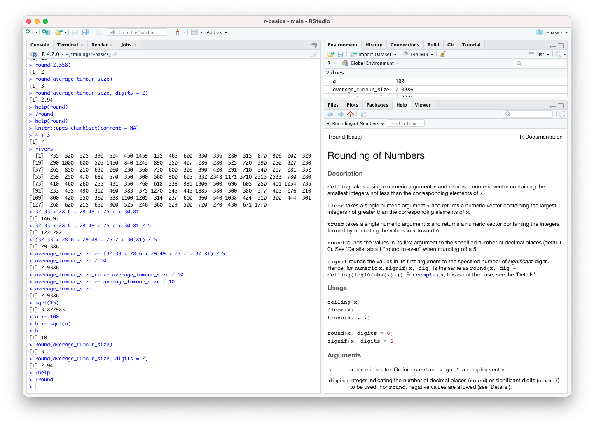
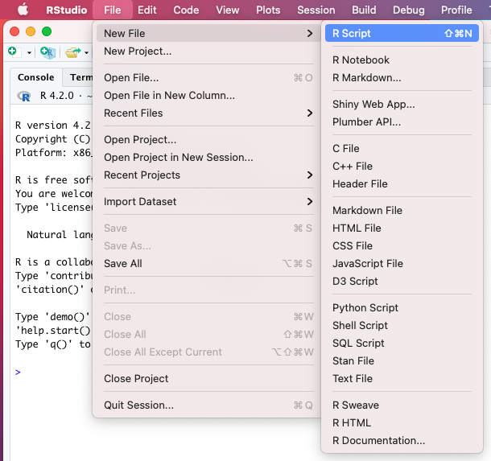
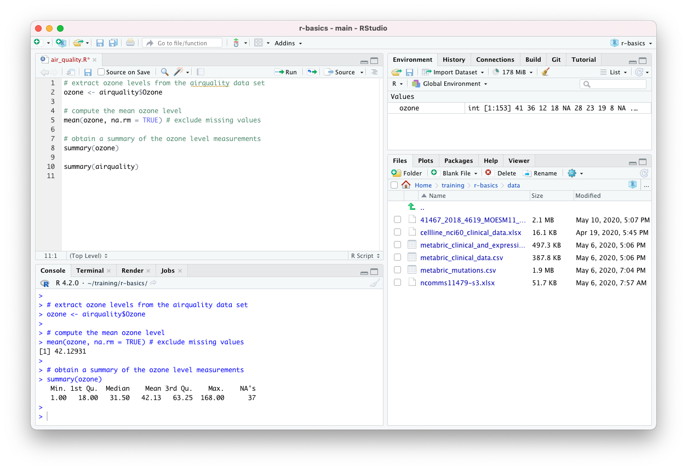
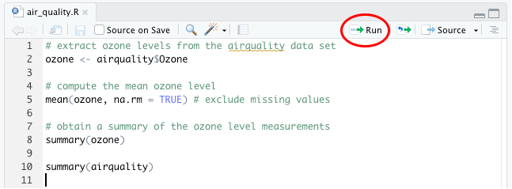

> #### Objectives
>
> * Get acquainted with the R command prompt
> * Create named objects and assign values to them
> * Create and work with vectors containing series of values
> * Call functions and use arguments to change their default options
> * Look at how R handles missing values
> * Write R code in a script

```{r setup, include=FALSE}
knitr::opts_chunk$set(comment = NA)
```

# Using R as a calculator

Open RStudio and type the following at the command prompt, **`>`** (in the console
tab pane), to add two numbers together.

```{r}
4 + 3
```

Clearly the answer is 7 but what's the `[1]` that you see printed before it?

Sometimes operations will return more than one value and these may get written
across several lines. Here's an example using one of the built-in datasets that
contains the lengths of the major North American rivers.

```{r}
rivers
```

The numbers in brackets are indexes for the first element printed on each line,
so the first line will always begin with `[1]` as that line starts with the
first element. If a subsequent line starts with `[11]`, for example, then the
first element printed on that line is the eleventh element within the list.

> **_Exercise_**
>
> Try doing some subtractions, multiplications and divisions at the R command
> prompt.
>
> The operator for multiplication is `*` and for division it is `/`.

Let's add several numbers together.

```{r}
32.33 + 28.6 + 29.49 + 25.7 + 30.81
```

And we'll divide by 5 to get the mean value.

```{r}
32.33 + 28.6 + 29.49 + 25.7 + 30.81 / 5
```

That doesn't look right. Can you see how R has interpreted this?

The last of our values, 30.81, was divided by 5 before adding the result to
the other values. This is because multiplication and division operations take
precedence over addition and subtraction and so they are calculated first.

We can use parentheses to ensure that our values are added together before
dividing by the number of values.

```{r}
(32.33 + 28.6 + 29.49 + 25.7 + 30.81) / 5
```

# Creating objects in R

If we want to use our average value, perhaps in another calculation, we need
some way of storing it for use later. We need to assign the value to an
*object* and we can do this with the assignment operator, `<-`.

```{r}
average_tumour_size <- (32.33 + 28.6 + 29.49 + 25.7 + 30.81) / 5
```

It is also possible to use `=` for assignment and if you're familiar with other
programming languages this will feel more natural. `<-` is preferred though and
there are some situations where using `=` may have unforeseen consequences.

Our new object is listed in the Environment tab in the top right panel in
RStudio.

{width=100%}
Objects are commonly referred to as *variables*, a term commonly used in other
programming languages.

We can now use our object in further calculations. For example, if our tumour
sizes were measured in millimetres and we wanted to convert the average value to
centimetres, we could do the following:

```{r}
average_tumour_size / 10
```

We could assign the converted value to another object,

```{r}
average_tumour_size_cm <- average_tumour_size / 10
```

or overwrite the existing one.

```{r}
average_tumour_size <- average_tumour_size / 10
```

To check a value of our object, we can get R to print it out in the
console by typing its name.

```{r}
average_tumour_size
```

# Vectors and data types

A *vector* is an ordered series of values and is the simplest data structure in
R. The `rivers` data set is an example of a vector.

We can create a vector of our tumour sizes using the `c()` function.

```{r}
tumour_sizes <- c(32.33, 28.6, 29.49, 25.7, 30.81)
tumour_sizes
```

We'll introduce functions in the next section but for now we note that `c`
stands for 'combine' and the `c()` function combines the values it is given
within the parentheses into a vector.

Most operations in R are *'vectorized'*, i.e. they can work on vectors. For
example we can convert our tumour sizes to centimetres in a single operation.

```{r}
tumour_sizes_cm <- tumour_sizes / 10
tumour_sizes_cm
```

Vectors contain values that are all of the same type. So far, we've only been
using numeric values but there are some other atomic data types including
Boolean (logical) and character values.

Character values are strings of characters enclosed in quotation marks.

```{r}
drug <- "Tamoxifen"
```

```{r}
drugs <- c("Tamoxifen", "Fulvestrant", "Olaparib", "Paclitaxel")
```

Logical values can be either `TRUE` or `FALSE`.

```{r}
positive_outcomes <- c(TRUE, FALSE, FALSE, TRUE, TRUE)
```

Logical values are produced when using logical operators, e.g. the greater than
operator `>`.

```{r}
average_tumour_size_cm > 3
```

We can also do this on vectors to produce logical vectors, something we'll come
back to shortly.

```{r}
tumours_larger_than_30mm <- tumour_sizes > 30
tumours_larger_than_30mm
```

> **_Exercise_**
> 
> Try creating a vector that contains values with different types (numeric,
> logical, character)
>
> Try different combinations of types and see what happens, for example
>
> `c(FALSE, 2.5)`
>
> `c(FALSE, 2.5, "hello")`

# Functions

R contains a large set of functions that do many useful operations. Let's have a
look at a simple example, the `log2()` function that calculates the base 2
logarithm of a number.

```{r}
log2(4)
```

A function usually takes one or more inputs known as *arguments*. Functions
often, but not always, return a value, which in turn can be assigned to an
object.

```{r}
a <- 10.25
b <- log2(a)
b
```

The `log2()` function only takes a single argument. Let's try a function that
can take multiple arguments: `round()`

```{r}
round(average_tumour_size)
```

By default the `round()` function rounds to the nearest whole number. We can
specify the number of digits to round to using the additional `digits` argument.

```{r}
round(average_tumour_size, digits = 2)
```

Information about a function can be found on its help page by typing `?round` or
`help(round)` at the command prompt.

```{r eval = FALSE}
?round
```

The 'Help' tab should be visible in the lower right panel in RStudio.

{width=100%}

The *Usage* section shows that the default value for the `digits` argument is 0
and that `digits` refers to the number of decimal places. The help page also
gives information for some related functions, `signif()`, `ceiling()`, etc.

So if we don't specify the value for digits, it will round to 0 digits (decimal
places), i.e. to the nearest whole number.

If we provide the arguments in the exact same order as they are defined we
don't have to name them.

```{r}
round(average_tumour_size, 2)
```

It's good practice to put the non-optional arguments, like the number we're
rounding in this case, first in the function call, in the order they're
expected (in which case you don't need to name them), and then use names for all
the optional arguments you're specifying. It will make it much easier for
someone reading your code and is less error-prone, particularly when using
functions with many arguments.

Many functions take vector arguments. Some are *vectorized* and carry out the
same operation on all the elements of the vector, e.g.

```{r}
log10(tumour_sizes)
```

Others compute a summary value from the given vector. For example, we can pass
our vector of tumour sizes to the `mean()` function to compute the average value
we calculated earlier.

```{r}
average_tumour_size <- mean(tumour_sizes)
average_tumour_size
```

> **_Exercise_**
> 
> Try computing some other summary statistics on the vector of tumour sizes
> using the functions, `sd()`, `var()`, `median()`, `IQR()`, `min()` and
> `max()`.
>
> Look up the Help page for these functions. Try running some of the example
> code snippets given in the *Examples* section in the help page.

We can nest function calls, one within another,

```{r}
average_tumour_size <- round(mean(tumour_sizes), digits = 1)
average_tumour_size
```

but this can make for code that is difficult to read. Usually it is better to
keep things simple even if you end up with code that is more verbose.

```{r}
average_tumour_size <- mean(tumour_sizes)
average_tumour_size <- round(average_tumour_size, digits = 1)
average_tumour_size
```

# Extracting subsets from vectors

One of the operations we do frequently is to select subsets of our data that are
of particular interest.

To select one or more values from a vector we need to provide the index or
indices within square brackets.

```{r}
tumour_sizes[3]
```

```{r}
tumour_sizes[c(1, 4, 5)]
```

It is also quite common to extract a range of values using the `:` operator.
The `:` operator creates a sequence of integer numbers.

```{r}
2:4
tumour_sizes[2:4]
```

## Conditional subsetting

Another way of subsetting a vector is to use a logical vector.

```{r}
selected <- c(TRUE, FALSE, FALSE, TRUE, TRUE)
tumour_sizes[selected]
```

You may be thinking that this seems very abstract and questioning why it would
ever be useful. But actually, it is probably the most commonly used way of
selecting values of interest from a vector.

Recall how we used the `>` operator to create a logical vector corresponding to
those tumours with a size greater than 30mm. We can use that to extract the
sizes of those tumours.

```{r}
tumours_larger_than_30mm <- tumour_sizes > 30
tumour_sizes[tumours_larger_than_30mm]
```

In practice, we wouldn’t really create a variable containing our logical vector
signifying which values are of interest. Instead we’d do this in a single step.

```{r}
tumour_sizes[tumour_sizes > 30]
```

Other logical operators include `==` (equal to), `!=` (not equal to), `<` (less
than), `<=` (less than or equal to) and `>=` (greater than or equal to).

We can combine logical operations using `&` and `|` operators which are the R
versions of the AND and OR operations in Boolean algebra but which are applied
to vectors.

For example, we could obtain the sizes of tumours that are between 27.5mm and
30mm.

```{r}
tumours_of_interest <- tumour_sizes >= 27.5 & tumour_sizes <= 30
tumour_sizes[tumours_of_interest]
```

Or in a single command:

```{r}
tumour_sizes[tumour_sizes >= 27.5 & tumour_sizes <= 30]
```

# Modifying vectors

We can add new values to a vector using the `c()` function.

```{r}
tumour_sizes <- c(tumour_sizes, 31.92, 24.11)
tumour_sizes
```

We can also combine two or more vectors in the same way.

```{r}
more_tumour_sizes <- c(26.34, 29.93)
tumour_sizes <- c(tumour_sizes, more_tumour_sizes)
tumour_sizes
```

One of more values in a vector can be changed using the same subsetting
operations we used before but this time assigning new values to the subset.

```{r}
tumour_sizes[3] <- 33.67
tumour_sizes
```

```{r}
tumour_sizes[c(2, 6, 7)] <- c(29.58, 25.55, 34.51)
```

```{r}
tumour_sizes[4:6] <- c(31.83, 25.99, 27.24)
```

# Missing values

Missing values are quite common in scientific data and R has a way of handling
these using the special value, `NA`, which stands for 'not available'.

The `airquality` example data set that comes with R contains missing values.
This data set is a table of daily air quality measurements taken in New York
and includes observations of ozone levels, wind speed and temperature. We'll
extract the ozone measurements from the table (Ozone column) as a vector.

```{r}
ozone <- airquality$Ozone
ozone
```

We'll be looking at tabular data in the next part of the course so don't worry
about the `$` operator we used here for now.

Most functions will return `NA` if the data they work on contain missing values.

```{r}
mean(ozone)
```

The `mean()` function, and many like it, takes the view that it cannot compute
the mean for a set of values where some are unknown. This is quite annoying but 
these functions usually have an argument named `na.rm` that can be set to
`TRUE` to remove the `NA` values before doing the calculation.

```{r}
mean(ozone, na.rm = TRUE)
```

# The very useful `summary()` function

One very useful function is `summary()`. As the name suggests this produces a
summary of the values it is given. It is really flexible and can take vectors of
different types, tables and other data structures.

```{r}
summary(ozone)
```

```{r}
summary(tumours_larger_than_30mm)
```

```{r}
summary(airquality)
```

# Scripting in R

Up to now, we were mostly typing code in the Console pane at the **`>`** prompt.
This is a very interactive way of working with R but it is also important to be
able to record the commands you've typed for when you come back to your analysis
later.

Instead we can create a script file containing our R commands; this is the way
most R coding is done.

From the RStudio '**File**' menu, select '**New File**' and then '**R Script**'.

{width=50%}

You should now have a new file in its own tab, named 'Untitled1', at the top of
the left-hand side of RStudio. The console window no longer occupies the whole
of the left-hand side.

We can type code into this file just as we have done at the command prompt in
the Console tab pane. Save changes you make using the '**Save**' option from
the '**File**' menu. There is also a button or you can use a keyboard shortcut.
On a Mac this is <kbd>cmd</kbd> + <kbd>S</kbd> (press the <kbd>cmd</kbd> key
first and, while keeping this depressed, click the <kbd>S</kbd> key); on Windows
it is <kbd>Ctrl</kbd> + <kbd>S</kbd>. RStudio will open a dialog box for you to
enter the file name and loation the first time you try to save a new file. It is
a good idea to regularly save changes to your script.

{width=100%}

## Running scripts

Having typed an R command and hit the return key you'll notice that the
command isn't actually run like it was in the console window. That's because
you're writing your R code in an editor. To run a single line of code within
your script you can press the '**Run**' button at the top of the script.

{width=60%}

This will run the line of code on which the cursor is flashing or the next line
of code if the cursor is on a blank or empty line.

The keyboard shortcut is more convenient in practice as you won't have to stop
typing at the keyboard to use your mouse. This is <kbd>cmd</kbd> +
<kbd>return</kbd> on a Mac and <kbd>Ctrl</kbd> + <kbd>enter</kbd> on Windows.

Running a line in your script will automatically move the cursor onto the
next command which can be very convenient as you'll be able to run successive
commands just by repeatedly clicking '**Run**' or using the keyboard shortcut.

You can also run the entire script by clicking on the '**Source**' button, a
little to the right of the '**Run**' button. More useful though is to run
'**Source with Echo**' from the Source drop-down menu as this will also display
your commands and the outputs from these in the Console window.

## Adding comments to your code

Anything that follows a `#` character within a line of code is ignored by R.
This is useful as it allows you to add comments and explanations to your code.

```{r}
# extract tumour sizes that are greater than 30mm
large_tumour_sizes <- tumour_sizes[tumour_sizes > 30]
```

Comments usually appear at the beginning of lines but can appear at the end of
an R statement.

```{r}
days <- c(1, 2, 4, 6, 8, 12, 16) # didn't manage to get a measurement on day 10
```

It is also quite common when looking at R code to see lines of code commented
out, usually replaced by another line that does something similar or makes a
small change.

```{r}
# random_numbers <- rnorm(100, mean = 0, sd = 1)
random_numbers <- rnorm(100, mean = 0, sd = 0.5)
```
