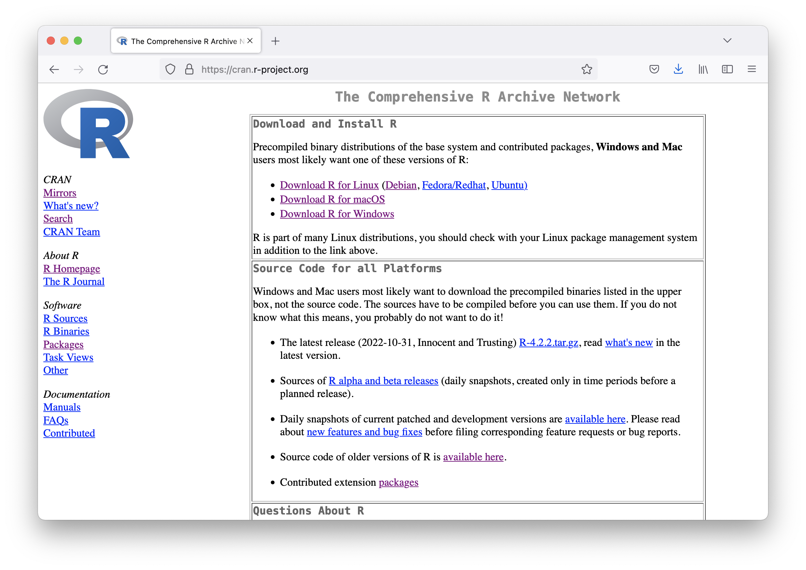
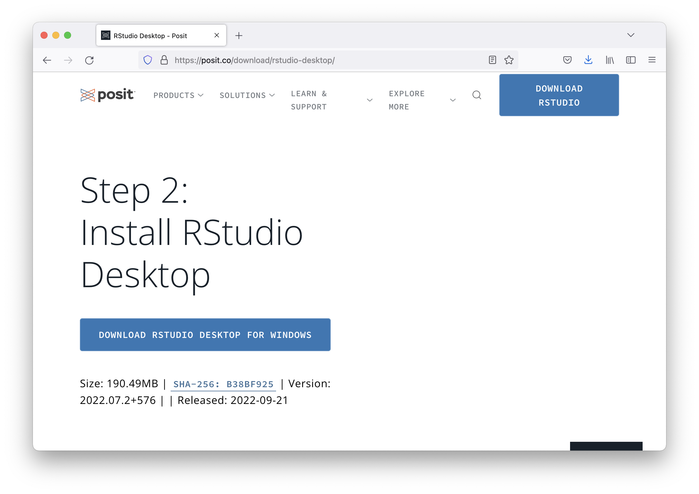
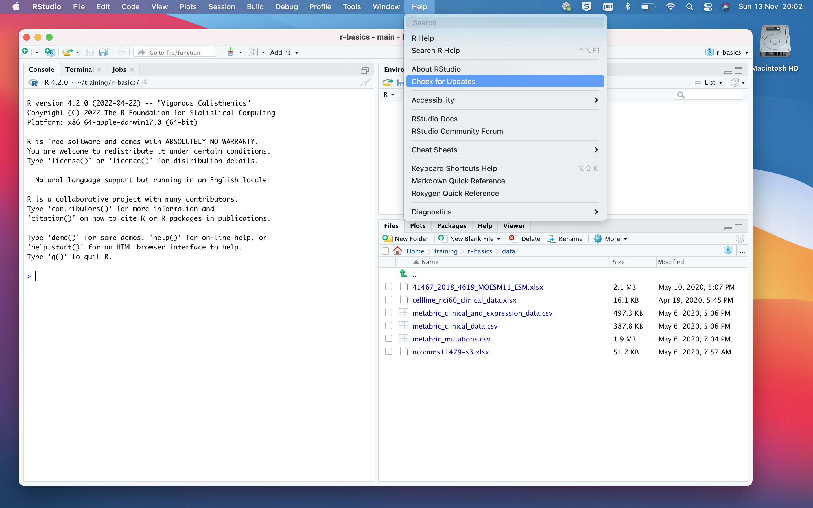
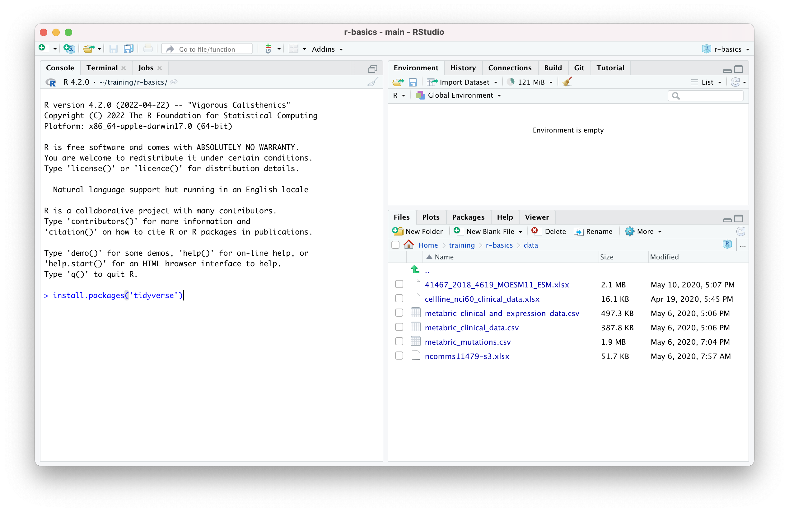
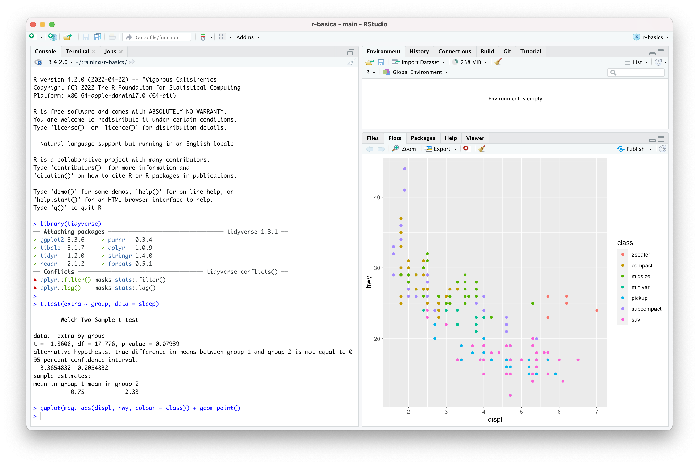

> #### Objectives
>
> * Install R and RStudio
> * Install the tidyverse collection of R packages

# Introduction

In this course we will be using **R**, **RStudio**, and some functions provided
by a collection of packages known as the **tidyverse**.

**R** is a programming language for statistical computing and graphics. The R
system provides an interpreter that executes commands typed at a command line.
It also provides a range of statistics and plotting functions out-of-the-box.

Most computational biologists work with R using **RStudio**, an integrated
development environment that provides lots of useful tools to make working in R
much easier and more productive. RStudio is a separate program you can
install alongside R on your computer. You will usually open RStudio instead
of R directly, and use the R session it provides.

One of the compelling reasons to learn R is the vast range of useful packages
that have been developed and made available that give you access to specialized
functions for just about any data type you can imagine. One of our favourite
collections of packages, the **tidyverse**, is, however, somewhat more general
purpose.

It is often the case that data need to be restructured or modified in some way
for the required analysis or visualization and the **tidyverse** packages
provide a useful and coherent set of functions for reading and manipulating
tabular data. The flexible and very popular **ggplot2** package for creating
graphs is also part of the tidyverse. Packages such as the tidyverse are easily
installed from a menu in RStudio or at the R command prompt.

# Installation options

To get ready for the training session you have two options:

1. Install R and RStudio on your laptop computer

2. Use a pre-installed R environment by logging into an RStudio server session

Installing R on your own computer is the best choice if you already know you
want to work with your data in R. However, if you're attending the session to
see what R can do but are not sure yet if it's really for you, then using one of
the RStudio servers might be the better option. Please note that the servers
will only be available for a limited time.

The following instructions are for those who will be installing and running R
on their own computer. If you'd prefer to use RStudio server in which everything
is already set up, please contact the instructor for login details.

If you already have R and RStudio server installed you may want to check on
what versions you are running and consider updating to the latest versions that
are available - see the section on upgrading below.

# Installing R

## Windows

* Download the installer from the [CRAN website](https://cran.r-project.org/),
  following the 'Download R for Windows' and 'base' links

* Run the .exe file that you just downloaded, named something like
  R-4.2.2-win.exe, by clicking on it in the Downloads area in your web browser

## Mac OS

* Download the installer from the [CRAN website](https://cran.r-project.org/),
  following the 'Download R for macOS' link and choosing the installer that
  matches your hardware, e.g. Apple M1 (ARM) or Intel
  
* Run the .pkg file you just downloaded, named something like R-4.2.2.pkg, by
  clicking in it in the Downloads area in your web browser

{width=90%}

# Installing RStudio

Please note that you should install R before you install RStudio.

RStudio is developed by Posit, a company that until recently was confusingly
also called RStudio. The desktop version of RStudio is free and versions are
available for Windows, Mac OS and Linux.

* Download the installer from https://posit.co/download/rstudio-desktop

* Run the .exe (Windows) or open the .dmg (Mac OS) file by clicking on it in
  the downloads area in your web browser

The page contains a button for downloading the RStudio installer and should
recognize your operating system. If it doesn't get it right, e.g. if it
suggests you 'Download RStudio Desktop for Windows' when you're using a MacBook,
you can scroll further down the page to find links to all the available
installers and choose the correct one.

{width=90%}

# Upgrading from older versions

If you already have R and RStudio server installed you may want to check that
you're using the latest versions. R version 4.0 or above should be ok for this
training session.

* Open RStudio, and click on "Help" > "Check for updates". If a new version is
  available, quit RStudio, and download and install the latest version (see
  above)

* If you've just opened RStudio the first thing that appears in the Console
  window should indicate the version of R you are running. Alternatively you
  can type `sessionInfo()` at the command prompt (`>`) in the Console window.

* Check the [CRAN website](https://cran.r-project.org) to see whether a more
  recent version of R is available. If so, download the installer for your
  operating system (Windows, Mac OS, etc.) and install as described above.

<br/>

{width=100%}

<br/>

# Installing the tidyverse packages

After installing R and RStudio you'll need to install the tidyverse packages.

* Open RStudio from the Start menu in Windows or the Launchpad in Mac OS, i.e.
  the same way you'd open other programs such as Excel
  
* Locate the 'Console' tab

* At the command prompt (`>`), type the following command:

```
install.packages('tidyverse')
```

{width=90%}

# Check everything is set up correctly

In the Console tab in RStudio, type the following commands at the `>` prompt:

```
library(tidyverse)
```

```
t.test(extra ~ group, data = sleep)
```

```
ggplot(mpg, aes(displ, hwy, colour = class)) + geom_point()
```

You should see the same output as in the following screenshot:

{width=100%}

